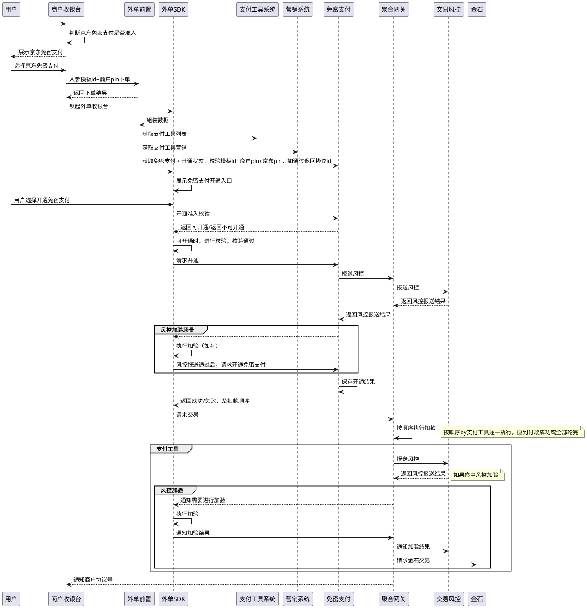

# PRD-外单免密支付（外单SDK+H5签+聚合网关）

> 本文档基于 JoySpace 线上文档（He335Y5JcKwgeAV7cqE4）的 JSON 内容转换为 Markdown
>
> 对应文档：[PRD-外单免密支付](https://joyspace.jd.com/pages/He335Y5JcKwgeAV7cqE4)

---

## 目录

1. [待确认问题](#1-待确认问题)
2. [一、需求背景](#2-一需求背景)
3. [二、产品概述](#3-二产品概述)
4. [三、需求详情](#4-三需求详情)

---

## 1. 待确认问题

**外单路由：** AI付，确认是否走到外单路由

| 问题 | 说明 |
|------|------|
| 外单路由 | AI付，确认是否走到外单路由 |
| 商户号问题 | 京东支付和免密支付视为独立产品，两个产品的定价可能出现差异——免密支付一个商户号，京东支付一个商户号 |

**商户入驻风控报送** —— 依赖枚举确认，风控涉及商户入驻页面改造

**内单/外单区别：**

| 分类 | 内场 | | | 外场 | | |
|------|------|---|---|------|---|---|
| | 主动支付 | | | 主动支付 | | |
| | 极速支付 | AI付 | 协议支付 | AI付 | **免密支付** | 协议支付 |
| **定位** | 京东商城通用快速付款 | 主打AI品牌和对话交互 | 为内场业务场景定时定额扣款 | 主打AI品牌和对话交互 | **为接入了京东支付2.0的商户，提供的快速付款产品** | 为外部商户提供定时定额扣款 |
| **是否开通** | 是 | 是 | 是 | 是 | **是** | 是 |
| **是否签约** | 否 | 是 | 是 | 是 | **是** | 是 |
| **签约内容** | / | pin+场景+额度 | pin+商户+模板+额度+支付工具 | pin+场景+额度 | **pin+商户+模板+额度+支付工具** | pin+商户+模板+额度+支付工具 |
| **是否免密** | 否 | 是 | 是 | 是 | **是** | 是 |
| **额度设定** | pin | pin+场景 | pin+商户（模板号） | pin+场景 | **pin+商户（模板号）** | pin+商户（模板号） |
| **是否跳端** | - | | | | **支持跳端** | 不跳端 |
| **是否有风控加验** | 是 | 是 | ？ | ？ | **是** | 否 |
| **系统架构** | | | | | | |
| **协议管理** | - | payuser | 协议支付 | payuser | **协议支付** | 协议支付 |
| **营销逻辑** | 收银台营销 | ？ | 代扣营销 | ？ | **收银台营销** | 代扣营销 |
| **营销试算** | 前置 | 前置 | | 同轨 | **同轨** | |
| **营销鉴权** | 内单网关 | 内单网关 | | 同轨 | **同轨** | |
| **轮询执行** | 聚合网关 | 聚合网关 | 代扣网关 | 聚合网关 | **聚合网关** | 代扣网关 |

---

## 2. 一、需求背景

### 2.1 需求价值

**（1）成单率视角**
- 经过外单付款能力向内单对齐的一系列改造，外单整体成单率向好，但与主要竞对仍有 gap，依靠内单功能形态继续补齐的优化空间有限

**（2）商户需求视角**
- 平台商户持续反馈：支付环节验证步骤导致用户咨询"为什么付款这么麻烦"，订单取消率上升
- 部分商户已在站外引导用户开通其他平台免密支付，要求支持不跳端的付款方式

**（3）竞对追齐视角**
- **支付宝：** 默认引导开通支付宝免密，小额支付零感知
- **拼多多：** 微信支付分免密覆盖全量用户，下单即扣款
- **抖音电商：** 抖音支付免密优先推荐，新用户首单即引导开通

**期望上线时间：** 0803版本

---

## 3. 二、产品概述

### 3.1 轮询付款产品清单

（详见上方表格）

### 3.2 外单免密支付产品定位

**产品目标：** 外场支付成功率 + 助力商户拓展

**产品定位：** 基于收银台模式衍生的轮询免密支付产品

#### 产品形态

| 环节 | 说明 |
|------|------|
| **商户签约** | 商户入驻时需要开通对应产品 |
| **用户签约** | 用户需要和对应商户签约后，才能使用 |
| **异常处理** | 支持支付失败等场景降级京东支付2.0（跳转收银台）；支持跳转至京东APP进行风控加验 |
| **定价** | 独立定价 |
| **实际交易** | |
| **协议签约** | payuser维护签约关系 |
| **交易执行** | 企业站/金石新增产品：免密支付产品 |
| **轮扣执行** | 聚合网关 |
| **营销规则** | 使用当前支付工具的实际营销（银行卡营销） |

### 3.3 免密支付和京东支付2.0的串联关系

（boardmix：xnH1x4uyMTRcx7NReup6aA）

外单路由：AI付，确认是否走到外单路由

### 3.4 模板及协议号管理

#### 模板号设置

- 商户入驻必要条件：商户已经开通京东支付2.0
- 商户开通免密支付时，分配免密支付商户号
- 商户开通免密支付产品后，支持单个商户基于不同场景申请多个签约模板
- 签约模板关联以下信息：

**基础信息：**
1. 协议名称
2. 商户名称
3. 协议描述

**签约内容：**
1. 使用额度（单日、单笔）
2. 单日使用次数
3. 支持的支付工具
   - 限单卡
   - 限支付工具

**签约方式（多选，至少选一个）：**
1. （本期-交易前签约）跳转到外单SDK收银台支付并签约
2. （交易后签约）外单SDK收银台支付完成后签约
3. （非交易签约）跳转到H5签约

**支付工具：**
1. 银行卡
2. 余额
3. 小金库（本期不含）
4. 白条（本期不含）

#### 1.3.2 协议号设置

### 5. 用户开通流程

#### 流程概述

用户→商户收银台→商户判断京东免密支付是否准入→展示京东免密支付入口

**存户流程：**

1. 用户进入商户收银台
2. 商户判断京东免密支付是否可用
   - **不支持：** 不展示 → 结束
   - **支持且已开通：** 展示京东免密支付
   - **支持未开通：** 展示京东免密支付+去开通文案
3. 存户选择免密支付
4. 商家调用收单接口 → 京东支付调用结果
   - 失败：返回报错
   - 成功：跳转京东APP
5. 前置判断免密开通准入
   - 未通过：进入收银台（不展示免密入口）
   - 通过：收银台展示免密入口+详情
6. 用户选择免密支付 → 核验（免密/加验）
   - 取消/失败：进入收银台
   - 通过：**触发风控报送**
7. 风控报送结果
   - **拦截：** 收银台（不展示免密入口）
   - **加验：** 按指令加验
   - **放行：** payuser开通免密支付交易
8. 加验结果
   - 通过：走payuser
   - 取消：进入收银台
9. **开通结果：**
   - 成功：聚合网关按顺序轮训扣款 → 支付成功
   - 失败：收银台（不展示免密入口）

**新户流程（存户流程的简化版）：**

1. 用户选择京东免密支付
2. 商家调用收单接口
3. 调用结果：
   - 失败：返回报错
   - 成功+免密不可用：跳转京东APP → 收银台（不展示免密入口）
   - 成功+免密可用：调用支付方式试算→获取支付工具/营销/顺序
4. 进行风控报送
   - 通过：聚合网关扣款
   - 不通过：跳转京东APP进行风控加验
5. 扣款结果：
   - 成功：支付成功
   - 失败：收银台（不展示免密入口）

---

## 4. 三、需求详情

### 4.1 用户开通流程（PlantUML）



### 4.2 关键流程节点（Mermaid）

```mermaid
flowchart TD
    A([用户进入商户收银台]) --> B{商户判断<br/>京东免密支付<br/>是否可用}
    B -->|链路1 不支持| C[不展示京东免密支付] --> Z([结束])
    B -->|链路2 支持且已开通| D[展示京东免密支付]
    B -->|链路3 支持未开通| E[展示京东免密支付<br/>附带去开通文案]

    subgraph 存户免密支付
        E --> F1[用户选择京东免密支付]
        F1 --> G1[商家调用支付收单接口]
        G1 --> H1{京东支付<br/>调用成功}
        H1 -->|否| I1[返回商户端<br/>提示失败重试] --> Z
        H1 -->|是| J1[跳转京东APP]
        J1 --> K1{前置判断<br/>免密开通准入}
        K1 -->|未通过| L1[进入收银台支付<br/>收银台不展示免密支付入口] --> M1([收银台支付完成])
        K1 -->|通过| N1[收银台展示<br/>免密支付入口和详情]
            N1 --> O1[用户选择免密支付
        O1 --> P1[开通核验]
        P1 --> Q1{核验结果}
        Q1 -->|取消/失败| R1[进入收银台支付<br/>收银台仍展示免密支付] --> S1([收银台支付完成])
        Q1 -->|通过| T1[触发风控报送]
        T1 --> U1{风控报送结果}
        U1 -->|拦截| V1[进入收银台<br/>收银台不展示免密入口] --> M1
        U1 -->|加验| W1[按风控指令加验]
        U1 -->|放行| X1[报送payuser开通<br/>免密支付交易]
        W1 --> Y1{加验结果}
        Y1 -->|通过| X1
        Y1 -->|取消| R1
        X1 --> Z1{开通结果}
        Z1 -->|成功| AA1[按免密支付工具<br/>聚合网关轮训扣款] --> AB1([支付成功])
        Z1 -->|失败| V1
    end

    subgraph 新户免密支付
        D --> F2[用户选择京东免密支付]
        F2 --> G2[商家调用收单接口]
        G2 --> H2{调用结果}
        H2 -->|调用失败| I2[返回报错] --> Z
        H2 -->|成功+免密不可用| J2[跳转京东APP]
        J2 --> K2[进入收银台<br/>收银台不展示免密入口] --> M2([收银台支付完成])
        H2 -->|成功+免密可用| L2[调用支付方式试算<br/>获取工具/营销/顺序]
        L2 --> N2[进行风控报送]
        N2 --> O2{报送结果}
        O2 -->|通过| P2[按免密支付<br/>聚合网关扣款]
        P2 --> Q2{扣款结果}
        Q2 -->|成功| R2([支付成功])
        Q2 -->|失败| S2[进入收银台<br/>收银台不展示免密入口] --> M2
        O2 -->|不通过| T2[跳转京东APP<br/>进行风控加验]
        T2 --> U2{加验结果}
        U2 -->|不通过| S2
        U2 -->|通过| P2
    end
```

---

## 附录：关联材料

### 1. 客服报备材料 — 京小贝接入AI付

**产品定位：** 京小贝AI助手接入金融业务场景，统一金融大脑中枢

**本期范围：** 白条账单还款

**核心流程：**
- 用户→京小贝MA→消金Agent（白条还款）→支付Agent（AI付）
- 获取AI付信息→返回收银台→展示支付工具→完成还款

**失败兜底：**
- 无可用支付工具→跳转还款页引导重新还款
- 非金融环境→跳转还款页引导重新还款

### 2. 埋点方案 — 外场AI付SDK+前端页

**SDK埋点：**
- SDK初始化（开始/成功/失败）
- 签约状态管理（绑定/解约/重试）
- 核验（免验/加验）
- 支付（发起/回调/结果）
- 流程编排（场景决策/兜底）

**前端页埋点：**
- Loading页（进入/离开/分流）
- AI付开通页（协议/绑定/结果）
- 声纹双端收音（眼镜+手机）

**参数数据字典：**
- deviceType: glass/mobile
- verifyType: none/voiceprint/authcode
- bindType: voiceprint/authcode

---

## 版本记录

| 版本 | 内容 | 作者 | 日期 |
|------|------|------|------|
| V1.0 | 原始PRD转MD | 王嘉怡 | 2025-06-15 |
| V1.1 | 补充客服报备+埋点 | 王嘉怡 | 2025-06-17 |